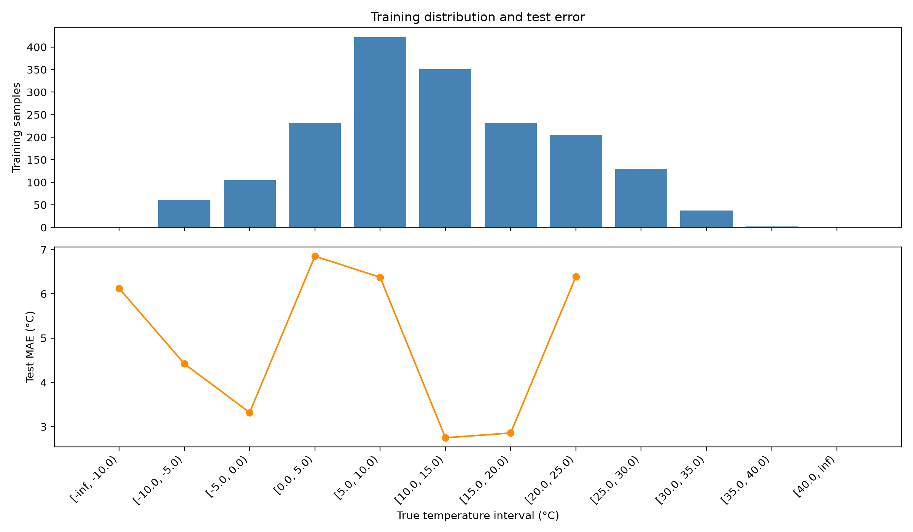

# SkyFinder Temperature Prediction with Deep Imbalanced Regression

An independent take-home experiment adapting **Label Distribution Smoothing
(LDS)** from *Delving into Deep Imbalanced Regression* to image-based ambient
temperature prediction.

> **Main finding:** LDS reduced validation MAE from **2.677 °C to 2.610 °C**, but
> test MAE increased from **4.922 °C to 6.315 °C**. Label imbalance mattered in
> some temperature ranges, but the cause of the worse test performance needs
> further controlled experiments.

The concise two-page report is available at
[`reports/SkyFinder_DIR_Brief_Report.pdf`](reports/SkyFinder_DIR_Brief_Report.pdf).

## Objective

This project predicts ambient temperature from SkyFinder images. It compares a
standard ResNet-18 regressor with the same architecture trained using
LDS-weighted loss, isolating the effect of label-distribution reweighting.

## Method

### Data

Images from SkyFinder cameras **858, 3888, and 4795** were joined with weather
metadata using camera ID and filename. Invalid temperatures and two truncated
JPEG files were removed.

Samples were split chronologically by capture date within each camera:

- 1,777 training images
- 375 validation images
- 395 test images

All images from the same date remain in the same split, reducing leakage from
near-duplicate adjacent frames.

### Model and training

The model uses an ImageNet-pretrained ResNet-18 with its classification layer
replaced by a one-output temperature-regression head. Images are resized to
224 × 224 pixels and normalized with ImageNet statistics. Random horizontal
flipping is applied only during training.

Both experiments use:

- AdamW optimizer
- Learning rate `1e-4`
- Weight decay `1e-4`
- Batch size 32
- 20 epochs
- Random seed 42

The baseline minimizes ordinary mean absolute error.

### Label Distribution Smoothing

For LDS, training temperatures are placed into 1 °C bins. Bin counts are
smoothed with a Gaussian kernel of size 5 and sigma 2. Each sample receives a
weight inversely proportional to the smoothed density of its temperature bin,
and the weights are normalized to mean 1.

The weighted absolute error is used only for optimization. Validation,
checkpoint selection, and final evaluation use ordinary unweighted metrics.
This repository implements LDS only; Feature Distribution Smoothing (FDS) and
the official two-stage RRT procedure are not included.

## Experimental results

All errors are reported in degrees Celsius. Checkpoints were selected using
unweighted validation MAE.

| Model | Validation MAE | Validation RMSE | Test MAE | Test RMSE |
|---|---:|---:|---:|---:|
| Training-median baseline | 10.226 | 11.010 | 5.945 | 7.803 |
| ResNet-18 baseline | 2.677 | 3.459 | **4.922** | **6.293** |
| ResNet-18 with LDS | **2.610** | **3.312** | 6.315 | 7.551 |

On validation data, LDS improved MAE by **0.066 °C (2.5%)** and RMSE by
**0.148 °C (4.3%)**. Its largest gains occurred below 0 °C:

- −10 to −5 °C: MAE decreased from 4.175 °C to 3.558 °C
- −5 to 0 °C: MAE decreased from 3.409 °C to 2.432 °C

### Baseline and LDS plots

Each plot shows training sample counts above and unweighted MAE by temperature
interval below. Compare models within the same evaluation split. The error axes
have different scales, so compare numeric values rather than visual heights.

| Evaluation split | Baseline (without LDS) | With LDS |
|---|---|---|
| Validation |  |  |
| Test |  |  |

Overall MAE weights each interval by its evaluation sample count; it is not the
simple average of the plotted interval errors. Intervals without evaluation
samples have no error point.

Aggregate metrics, temperature-bin tables, training histories, and analysis
plots are stored in [`results/`](results/).

## Analysis

The validation result supports the intended role of LDS: neighboring labels
share information, and rare low-temperature samples receive more influence
during training. The improvement was not uniform. Validation MAE in the 5 to
10 °C interval increased from 6.316 °C to 7.706 °C, showing that
inverse-density weighting can trade performance between label regions.

The chronological test split was substantially colder than the training and
validation splits. Their mean temperatures were 5.89 °C, 11.36 °C, and
13.25 °C, respectively. Both models overpredicted test temperatures, but the
mean prediction bias was larger with LDS (+4.95 °C) than with the baseline
(+3.82 °C).

LDS slightly improved validation performance in this run but increased error
on the final test period. The colder test temperatures establish a label
distribution difference, but these results alone do not isolate its causal
role. Additional seeds and controlled weighting experiments are needed to
distinguish temporal distribution effects, weighting effects, and training
variability.

## Improvements

- Tune LDS bin width, kernel size, sigma, and a maximum weight cap using only
  the validation set. The current maximum sample weight is approximately 24.1.
- Implement FDS and compare baseline, LDS, FDS, and LDS + FDS under the same
  protocol.
- Add more cameras and seasons while preserving leakage-safe temporal splits.
- Run multiple random seeds and report uncertainty.
- Examine time of day, weather metadata, camera identity, and prediction
  calibration as possible sources of error.

## Reproduce the experiment

Python 3.10 or newer is recommended.

```bash
git clone https://github.com/winmpkid/skyfinder-temperature-dir.git
cd skyfinder-temperature-dir
python3 -m venv .venv
source .venv/bin/activate
python -m pip install --upgrade pip
python -m pip install -r requirements.txt
```

The training script automatically selects CUDA, Apple Silicon MPS, or CPU.

### Prepare SkyFinder

The dataset is not redistributed in this repository. Download the images and
metadata from the [official SkyFinder dataset
page](https://mvrl.cse.wustl.edu/datasets/skyfinder/) and arrange them as:

```text
datasets/
├── complete_table_with_mcr.csv
└── images/
    ├── 858/*.jpg
    ├── 3888/*.jpg
    └── 4795/*.jpg
```

Generate the cleaned manifest and chronological splits:

```bash
python src/prepare_data.py
```

### Train

```bash
# Standard ResNet-18 baseline
python src/train.py

# ResNet-18 with LDS-weighted loss
python src/train.py --lds
```

Run `python src/train.py --help` to view the LDS and training controls.
Checkpoints are generated locally and are not committed because each is about
128 MB.

### Evaluate

```bash
python src/evaluate.py --checkpoint best_resnet18.pt \
  --output-prefix baseline --model-label "ResNet-18 baseline" --split val

python src/evaluate.py --checkpoint best_resnet18.pt \
  --output-prefix baseline --model-label "ResNet-18 baseline" --split test

python src/evaluate.py --checkpoint best_resnet18_lds.pt \
  --output-prefix lds --model-label "ResNet-18 with LDS" --split val

python src/evaluate.py --checkpoint best_resnet18_lds.pt \
  --output-prefix lds --model-label "ResNet-18 with LDS" --split test
```

### Test the LDS utilities

```bash
python -m unittest discover -s tests -v
```

## Repository contents

```text
src/          data preparation, Dataset, model, training, and evaluation
tests/        unit tests for the LDS kernel, weights, and weighted L1 loss
results/      aggregate outputs from the reported baseline and LDS runs
reports/      concise experiment report
scripts/      report-generation source
datasets/     local SkyFinder files; not tracked
data/         generated manifest; not tracked
checkpoints/  generated model weights; not tracked
```

## References and attribution

1. Yuzhe Yang, Kaiwen Zha, Ying-Cong Chen, Hao Wang, and Dina Katabi.
   [Delving into Deep Imbalanced
   Regression](https://proceedings.mlr.press/v139/yang21m.html). ICML, 2021.
   [Official implementation](https://github.com/YyzHarry/imbalanced-regression).
2. Radu Bogdan Mihail, Scott Workman, Zach Bessinger, and Nathan Jacobs. *Sky
   Segmentation in the Wild: An Empirical Study*. WACV, 2016.
   [Dataset page](https://mvrl.cse.wustl.edu/datasets/skyfinder/).

See [`THIRD_PARTY_NOTICES.md`](THIRD_PARTY_NOTICES.md) for implementation
attribution. Original code in this repository is released under the
[`MIT License`](LICENSE).

This is an independent implementation of a public take-home exercise. It is
not an official UCLA or Health Intelligence Lab project.
